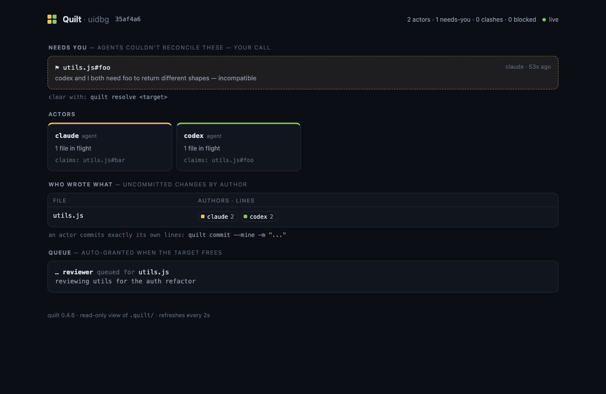

# Quilt

<!-- mcp-name: io.github.wkoverfield/quilt -->

[](https://github.com/wkoverfield/quilt/actions/workflows/ci.yml)
[](https://www.npmjs.com/package/@quilt-dev/cli)
[](https://www.npmjs.com/package/@quilt-dev/cli)
[](LICENSE)

Quilt is a command-line tool that tracks which agent wrote which lines in a
shared Git checkout, so multiple AI coding agents can work in one repo at once
and each commits only its own changes.

It captures every edit at the tool boundary, keeps a per-line record of who wrote
what, and reconstructs each agent's own changes at commit time. Git stays the
source of truth. Quilt never calls an LLM or spawns agents, and its state lives in
a `.quilt/` sidecar you can delete without touching your repo.


```bash
npm install -g @quilt-dev/cli
quilt setup     # capture hooks wired, protection live (MCP tools optional, on top)
```

## The problem

You want your agents in ONE checkout: one `node_modules`, one build, one dev
server, one environment to keep working, not a worktree per agent, each with
its own install and its own drift. But on a shared checkout, plain git bites
even when agents work on completely different things: the first `git commit -am`
sweeps everyone else's uncommitted files into one blob, codegen and lockfile
churn get credited to whoever committed last, and two agents occasionally do
land on the same line, where one silently overwrites the other. None of that
requires agents to be working on the same task. It's just what a shared
checkout does by default.

Quilt makes the shared checkout safe. Every agent commits exactly its own
lines and nothing else: disjoint work stays disjoint all the way into
history, with no ceremony. And when two agents genuinely want the same code,
that becomes a coordinated handoff instead of a silent loss. It holds as you
add agents.

`./examples/fleet.sh` runs seven agents against one checkout. The two endings:

```txt
WITHOUT quilt   1 commit for 7 agents — six got "nothing to commit", their
                work swept into the first agent's blob. a7 silently
                overwrote a1's change to getUser. a1's work is gone.

WITH quilt      6 clean commits, one per agent, each exactly its own lines.
                a7's write into a1's claimed function was denied before any
                bytes changed, with a1's stated intent in the denial.
```

## When two agents want the same file

Fanning out on disjoint files is the easy case. The real test is contention.
A denied claim isn't a dead end. It carries the holder's stated intent and
when their lease lapses:

```txt
$ QUILT_ACTOR=builder-flows quilt claim deals.js flows.js --intent "wire flows to deals"
  ✗ denied  deals.js (held by builder-friction)
      builder-friction is: friction pass: rename + archive flags
      their claim lapses 2026-07-04T22:12:05Z unless renewed
  ✓ claimed flows.js
```

So the blocked agent builds its granted files while it waits, re-claims after
the holder's commit auto-releases, and layers its change on top of the landed
one. Two clean commits, both changes in the file, nothing lost.
`./examples/contention.sh` runs the whole sequence on the real machinery.

## What it does

- **One shared checkout.** Model humans, agents, and bots as actors editing one
  working tree, no worktree per agent.
- **Line-level attribution.** `commit --mine` commits only your lines, even when
  they share a hunk with another actor's.
- **Symbol-level claims.** Reserve `utils.js#formatPrice`, not the whole file, so
  agents editing different functions never contend. Ten languages via tree-sitter;
  whole-file claims for the rest.
- **Collision prevention.** A write into code another agent has claimed is denied,
  with the holder's stated intent, before any bytes change.
- **Push-awareness.** Claim a symbol that depends on a function another actor is
  changing, and Quilt warns you at claim time.
- **Detect and preserve.** If one actor overwrites another's uncommitted lines,
  Quilt snapshots the victim's version so nothing is silently lost.

Every commit Quilt produces is an ordinary Git commit. It trusts Git and never
rewrites it, and all state lives locally under `.quilt/`. No account, no daemon.

## Quickstart

```bash
quilt setup      # wire Quilt into the repo (capture hooks + optional MCP tools)
quilt doctor     # confirm it's wired and capture is flowing
```

That's it. Agents are named automatically: each Claude Code session or MCP
connection gets its own id, so parallel agents are told apart with no setup.

### 4 terminals, one repo

The whole flow, from a git repo to four agents working at once:

```bash
cd your-repo
quilt setup          # once, ~5 seconds
claude               # terminal 1
claude               # terminal 2
claude               # terminal 3
claude               # terminal 4
```

Start sessions from a directory that holds several repos? Run `quilt setup`
there instead: it wires the workspace root and every repo inside, and each
edit is captured into the repo its file belongs to.

Nothing else. No `QUILT_ACTOR`, no per-terminal ceremony, nothing to approve:
the capture hooks attribute every edit to its session automatically. Watch it
live with `quilt fleet`, and when a session's work is ready, ask it to run
`quilt commit --mine -m "..."`. Each commit contains exactly that session's
lines, even where two sessions touched the same file. (Claude Code will also
offer to enable the optional quilt MCP server for the project; approving it
adds the claim/prevention tools, but the hooks protect you either way.)

### Watch the fleet

`quilt ui` opens the same picture in your browser, live: who wrote what
(per-actor line counts per file), active claims, who's blocked on whom, and
anything that needs a human. Local-only (127.0.0.1), read-only, one command.



Prefer the terminal? `quilt fleet --watch` is the same view as text.

Set an explicit id when you want one that is stable across sessions:

```bash
QUILT_ACTOR=auth-agent claude    # this agent's edits are attributed to auth-agent
```

Then each agent commits only its own lines:

```bash
quilt status                     # who owns what
quilt preview --mine             # exact patch that would be committed
quilt commit --mine -m "fix auth redirect"
```

In a shared shell, make the committer explicit (`quilt --as auth-agent commit
--mine ...`). Quilt refuses a checkout-global session identity when the dirty
tree shows another actor. If a deploy provider requires a recognized Git email,
set one once while keeping actor names distinct:

```bash
quilt config author.email you@example.com
```

`quilt fleet` shows the whole picture: every actor, their claims, and anything
that needs a human. See [docs/reference.md](docs/reference.md) for the full
command list.

## Why not worktrees?

A worktree per agent is the usual answer, and for fully independent tasks it
works. But every worktree is another environment to build (another install,
another build cache, another dev server) and isolation just moves the
collision to merge time. Those costs grow with the number of agents; the whole
point of a shared checkout is paying for the environment once.

|                                 | Run fewer agents | Worktree per agent          | Quilt                       |
| ------------------------------- | ---------------- | --------------------------- | --------------------------- |
| Parallelism                     | capped low       | high                        | high                        |
| Setup per agent                 | none             | full install/build/env × N  | none (one checkout)         |
| See each other's in-flight work | n/a              | no                          | yes                         |
| Collisions                      | avoided by hand  | surface at merge            | prevented, or surfaced live |
| Clean per-agent commits         | n/a              | after a merge               | yes                         |

Worktrees isolate; they don't coordinate. When agents work the same code at the
same time, you usually want them to see each other and account for each other as
they go. That is what Quilt does. The two aren't mutually exclusive: worktrees for
independent, long-running work, Quilt for agents in the same code at once.

## Using it with agents

`quilt setup` wires the capture hooks and a shared MCP server. On Claude Code the
hooks let agents use the built-in Edit and Write tools normally while Quilt
records each change's author and blocks a write into code another agent holds,
with no protocol for the agent to follow and no setup: each session is named
automatically, or carries its own `QUILT_ACTOR` for a stable id. For other
runtimes, the same capture and prevention is available as MCP tools, with each
connection named automatically the same way.

See [docs/orchestrators.md](docs/orchestrators.md) for Codex, Cursor, Aider, and
the difference between process-per-agent and many-agents-in-one-process setups.

## Docs

- [docs/orchestrators.md](docs/orchestrators.md): running a fleet of agents.
- [docs/reference.md](docs/reference.md): the full command list, how attribution
  works, and the `.quilt/` state layout.
- [bench/](bench/): the scenario ladder Quilt is tested against, run with and
  without Quilt on the same metrics.

## Telemetry

Off by default, and opt-in for real: `quilt setup` asks once, on an
interactive terminal only, and no answer means no. If you say yes, Quilt
sends anonymous usage counts (which commands run, how many claims were
granted/denied/queued, quilt version, OS) under a random id generated on
your machine. It never sends code, file paths, repo names, actor names,
branch names, or commit messages, and events are posted by a detached
process so no command ever waits on the network. Change your mind any
time with `quilt telemetry on|off`, or set `QUILT_TELEMETRY=0` to force
it off for any process (useful in CI). The full event list is in
[docs/reference.md](docs/reference.md).

## Contributing

Contributions are welcome. See [CONTRIBUTING.md](CONTRIBUTING.md).

## License

MIT
